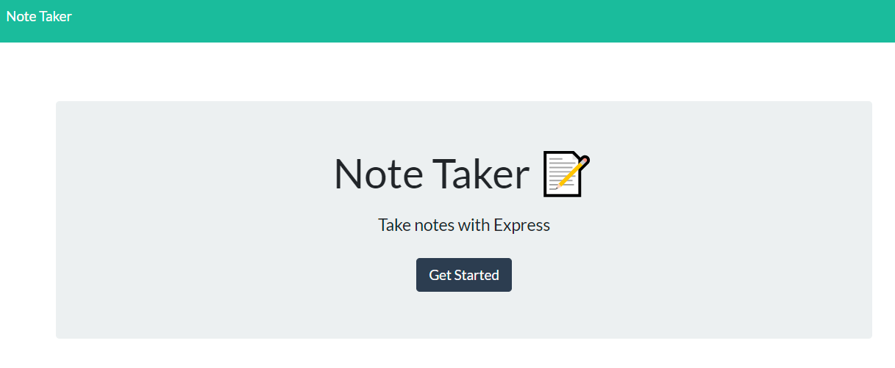

# Note Taking Application

## Description

Uses nodejs and express.js to host a web-based note taking application. A simple json file acts as a database for the notes. You can save notes, view notes, and delete notes. The underlying framework uses GET, POST, and DELETE requests to handle the modification of the notes.

User Story:
As a small business owner, I want to be able to write and save notes, so that I can organize my thoughts and keep track of tasks I need to complete.

Acceptance Criteria: Given a note-taking application

1. When I open the Note Taker, then I am presented with a landing page with a link to a notes page.
2. When I click on the link to the notes page, then I am presented with a page with existing notes listed in the left-hand column, plus empty fields to enter a new note title and the note’s text in the right-hand column.
3. When I enter a new note title and the note's text, then a Save icon appears in the navigation at the top of the page.
4. When I click on the Save icon, then the new note I have entered is saved and appears in the left-hand column with the other existing notes.
5. When I click on an existing note in the list in the left-hand column, then that note appears in the right-hand column.
6. When I click on the Write icon in the navigation at the top of the page, then I am presented with empty fields to enter a new note title and the note’s text in the right-hand column.

Building this application allowed me to experiment with simple GET, POST, and DELETE requests. Using express.js and its router class was helpful in structuring the code into a sensible and readable structure.

## Table of Contents

1. [Installation](#installation)
2. [Usage](#usage)
3. [License](#license)
4. [Contribute](#contribute)
5. [Tests](#tests)
6. [Questions](#questions)

## Installation

To install the program, clone the repo from github onto your local machine. Navigate to the newly downloaded code. Open a command-line terminal and run `npm install`. If you do not have nodejs and npm installed, install those first before running npm install. After npm install is complete, you are ready to run the program!

## Usage

From the command line, run `npm start`. This will start the server backend. In the terminal, a link will appear directing you to the hosted webpage. Navigate to the URL to access the front-end of the application!

If you wish to deploy this to Heroku, follow the installation instructions above, then follow this [heroku installation and deployment guide.](https://devcenter.heroku.com/articles/getting-started-with-nodejs?singlepage=true)

When loading the application you will be presented with the launch screen.

Clicking on the get started button will take you to the application. If it's your first time visiting the site, it'll be empty except for a field to write a new note. If you have saved previous notes, your webpage will look like the images below.

Clicking the plus icon in the upper-right-hand corner of the web page will clear the note title and note text for you to write a new note. Once you've written some text in both the title and text, a save icon will appear. Clicking the save icon will save the note onto the server and add it to the entries in the left hand column. If you wish to view a previous note, click on the note in the left hand column. It'll display the title and its content in the larger pane to the right. If you no longer need a note, click on the red trashcan icon. It'll delete the note from the list and from the server. WARNING: If you delete a note, it cannot be recovered.

## License

MIT

Copyright (c) 2022 James Perry

Permission is hereby granted, free of charge, to any person obtaining a copy of this software and associated documentation files (the "Software"), to deal in the Software without restriction, including without limitation the rights to use, copy, modify, merge, publish, distribute, sublicense, and/or sell copies of the Software, and to permit persons to whom the Software is furnished to do so, subject to the following conditions:

The above copyright notice and this permission notice shall be included in all copies or substantial portions of the Software.

THE SOFTWARE IS PROVIDED "AS IS", WITHOUT WARRANTY OF ANY KIND, EXPRESS OR IMPLIED, INCLUDING BUT NOT LIMITED TO THE WARRANTIES OF MERCHANTABILITY, FITNESS FOR A PARTICULAR PURPOSE AND NONINFRINGEMENT. IN NO EVENT SHALL THE AUTHORS OR COPYRIGHT HOLDERS BE LIABLE FOR ANY CLAIM, DAMAGES OR OTHER LIABILITY, WHETHER IN AN ACTION OF CONTRACT, TORT OR OTHERWISE, ARISING FROM, OUT OF OR IN CONNECTION WITH THE SOFTWARE OR THE USE OR OTHER DEALINGS IN THE SOFTWARE.

## How to Contribute

Before contributing, be sure to read the GitHub [Code of Conduct](https://github.com/github/docs/blob/main/CODE_OF_CONDUCT.md). If you have an issue, search all open issues to see if one matches the description of your issue. If not, proceed to create one providing details on the issue, errors, OS, options provided, installed node packages, etc. Issues are not assigned to anyone by the repository team. To select an issue to work on, open a pull request and generate a new branch labeled as the issue. Add your name as a contributor to the issue in question. When you make the desired changes and fixes, push all changes to your branch on the repository and submit. The repository team will review the changes. If acceptable, we will merge the changes to main and we will notify you of a successful merge or any necessary changes before a merge can take place.

## Tests

No Tests Provided.

## Questions

Repo owner: [pbp66](https://github.com/pbp66).
For any questions, you may contact pbp66 via email: perryjames00@gmail.com. Please format your email using the following template:

- Subject: Repository - Question/Issue
- Body: Summarize the issue with a brief description for the first paragraph. Additional paragraphs can be used for a long description, if needed. Include any errors when using this project
- Signature: Please leave an email address so that any updates are sent get back to you.
